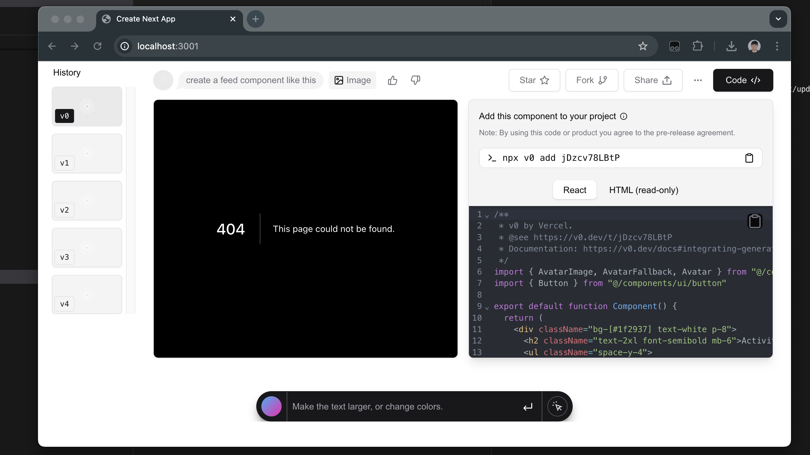

# v0 clone (earlier UI)

|  |
| - |

Clone of v0 frontend, I did this mainly by using Gemini's 1M coding model. This was done a while back.

Copied the src of v0 and told it to generate components segment by segment eg

```
prompt:
src of v0.dev

let's focus on this section:
<section of code i want to make into a component>

generate react code for this and segment any SVGs or icons into their own react component. We should have a file icons.tsx you place any svgs in and you should use that component in the react code you generate.
```


This was over a year ago and I was very surprised with the results. I iterated on it and came up with some decent UI.

This has been sitting scrapped as I was planning on integrating it with my figma extension a while back.

Feel free to copy it license is MIT. Although you probably wont be able to make a for-profit project from it since Vercel owns the styling, CSS, design.

This was a mere proof of concept for me to see how far LLM UI generation can go.

Nowadays an agentic UI cloner exists and you can go pretty far without 1M context legnth. You can simply just uplod an image and the VLM segments out the instructions.

Then an agent executes them to clone the site.

## Getting Started

First, run the development server:

```bash
npm run dev
# or
yarn dev
# or
pnpm dev
# or
bun dev
```

Open [http://localhost:3000](http://localhost:3000) with your browser to see the result.

You can start editing the page by modifying `app/page.tsx`. The page auto-updates as you edit the file.

This project uses [`next/font`](https://nextjs.org/docs/app/building-your-application/optimizing/fonts) to automatically optimize and load [Geist](https://vercel.com/font), a new font family for Vercel.
